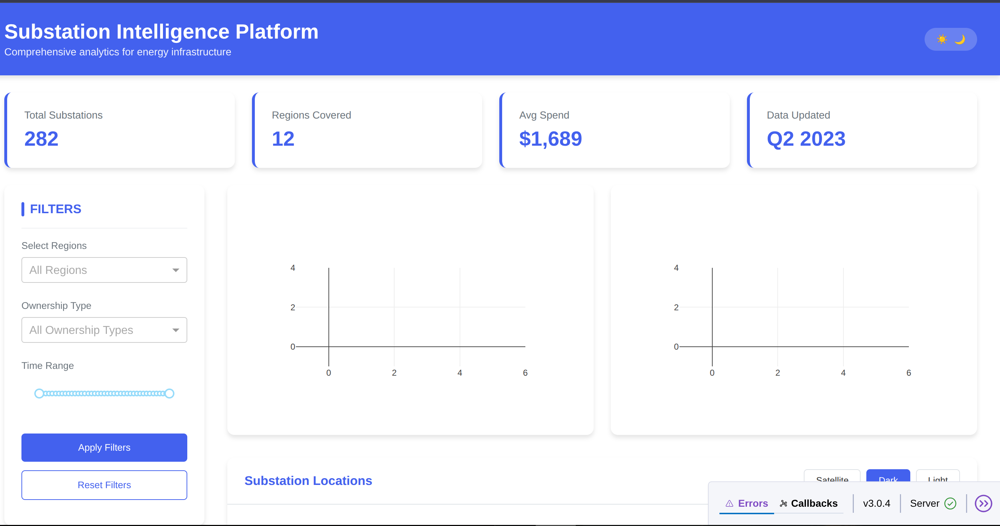

# ⚡ Substation Intelligence Dashboard

  
*A modern analytics platform for visualizing and analyzing substation infrastructure.*

---

## 🌟 Features

- **🗺️ Interactive Map Visualization**  
  - Clustered map of substations with support for satellite, dark, and light views  
  - Popups with name, region, ownership, and coordinates  

- **📊 Advanced Analytics Dashboard**  
  - Trend lines for planning/maintenance spending  
  - Ownership-based pie charts  
  - Summary metric cards  

- **🔍 Dynamic Filtering**  
  - Filter by **region**, **ownership type**, and **fiscal year**  
  - Reset to default filters with one click  

- **🎨 Clean UI & UX**  
  - Light/Dark mode toggle  
  - Fully responsive layout  
  - Color-coded and styled charts
  - Enhanced Filtering

---

## 🛠️ Tech Stack

- **Python** 🐍  
  - `pandas` — data processing  
  - `plotly.express` — interactive graphs  
  - `folium` — geographic mapping  

- **Dash (by Plotly)** 📊  
  - Web dashboard framework  

- **HTML / CSS** 💅  
  - UI styling and layout  

---

## 📂 Project Structure

```bash
substation-intelligence-dashboard/
├── Substation_main.py                # Dash application
├── maindataset.xlsx      # Main Excel dataset
├── requirement.txt      # Dependencies
├── README.md             # Project overview
└── assets/               # Screenshots and logos
    ├── dashboard_light.png
    ├── Dataset_table.png
    └── Map_working.png
```
